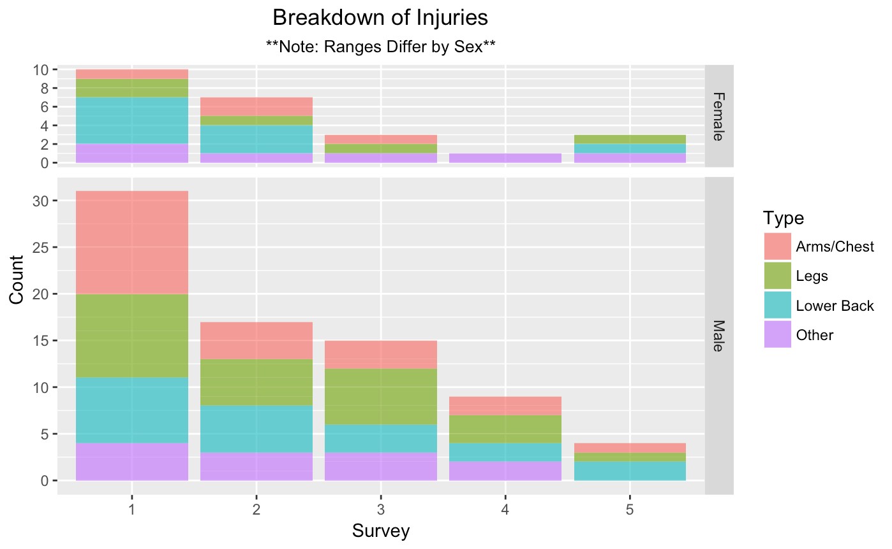
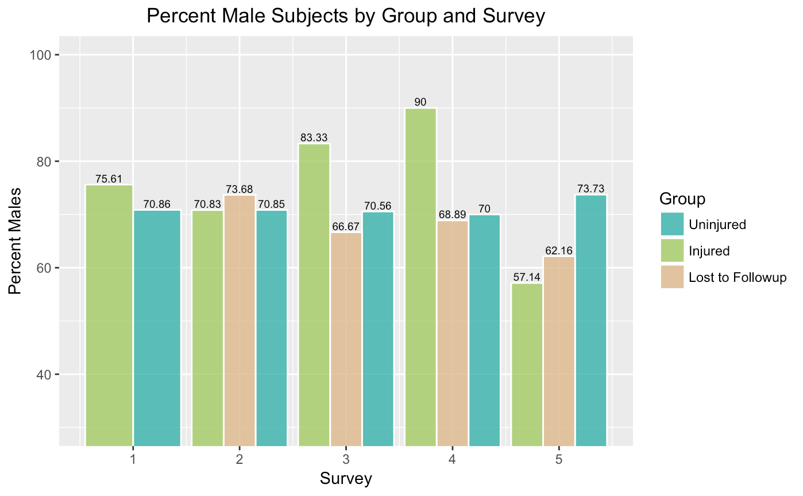
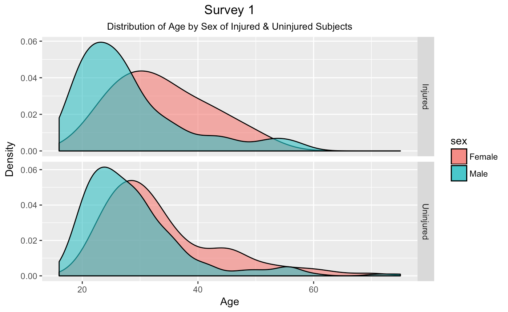
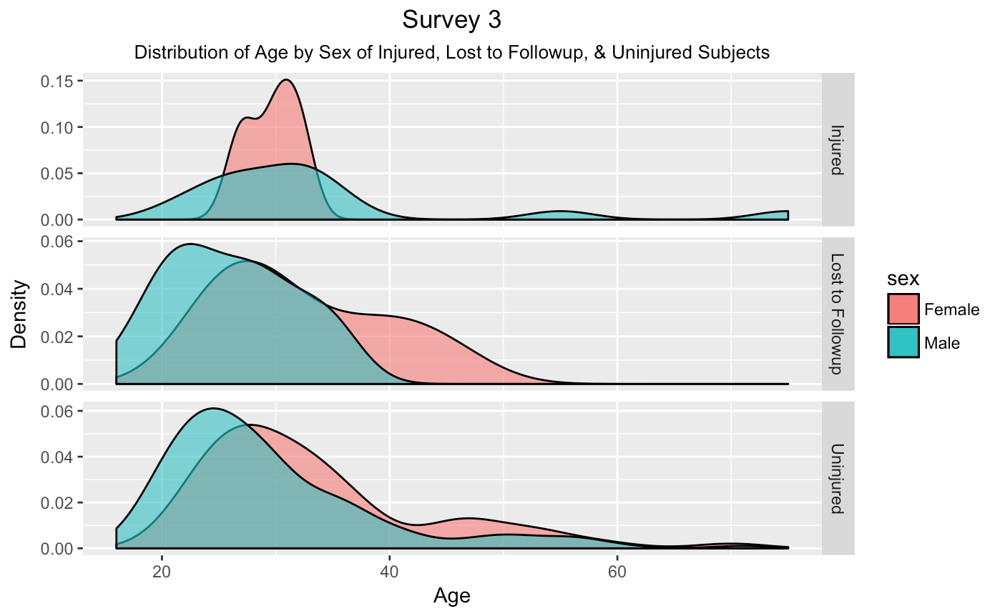
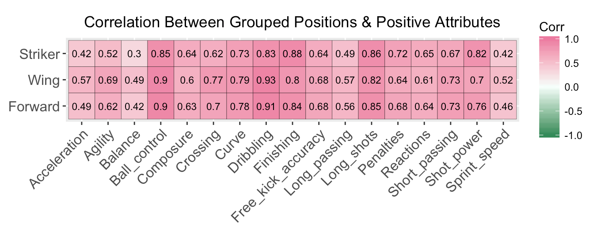
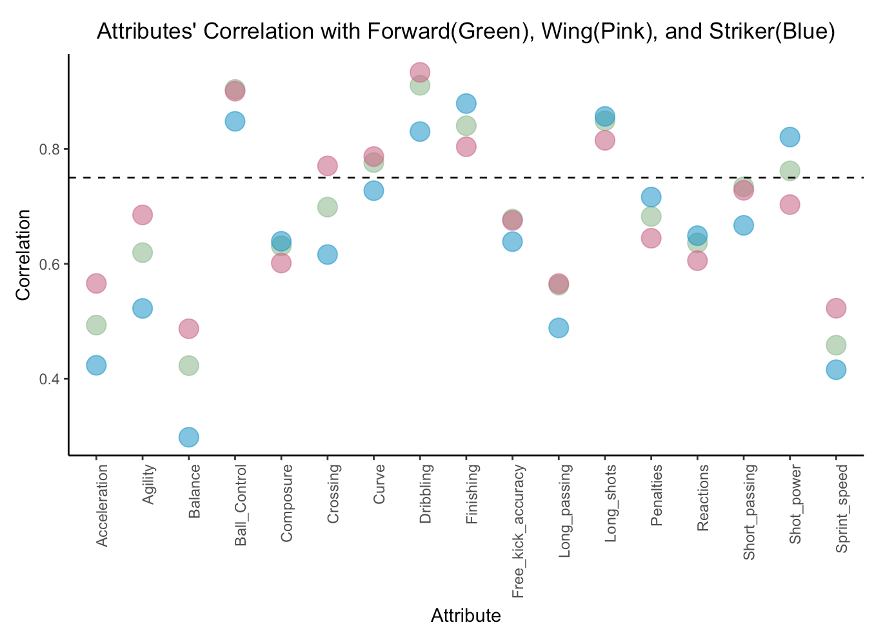
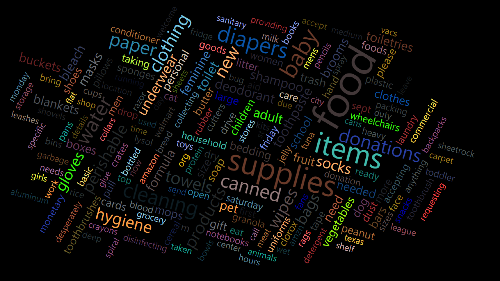
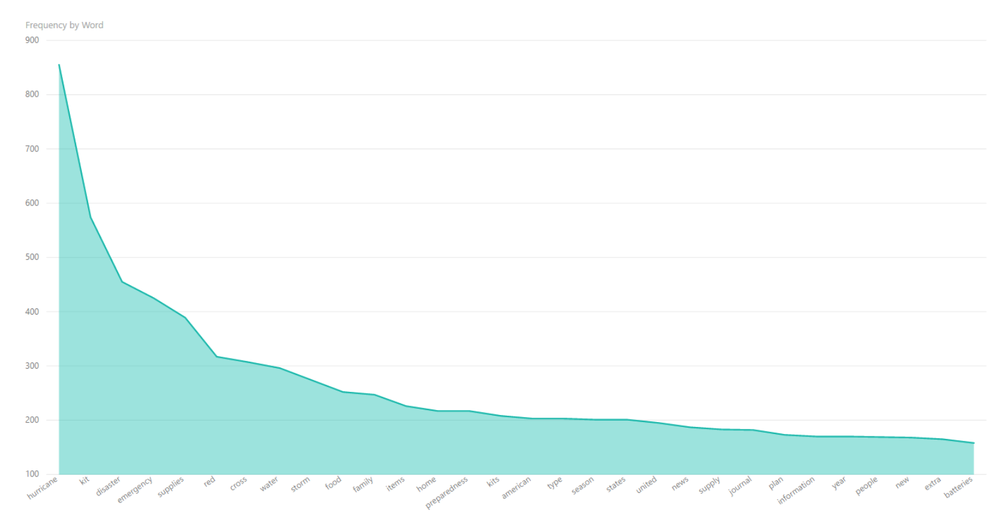

```{r setup, include=FALSE}
#useful R packages
library(tidyverse)
library(knitr)
library(png)
```

#Stronger by Science 
**Context:**  
The visuals below were produced from monthly survey data following strength-training athletes. The goal of this study is to conduct Survival Analysis on strength athletes, specifically "powerlifters," and identify any significant trends in injury reporting.  

Variable | Definition
----------------- | ---------------------------------------------------------------------------------------
Uninjured | Subjects who have not yet reported an injury. They will continue receiving surveys until the end             of the research period or until they sustain an injury.
 | 
Injured | Subjects who have reported sustaining an injury in the last 30 days of receiving that month's                  survey. These subjects will stop receiving surveys from that point on.
 | 
Lost to Followup | Subjects who had not reported having an injury, but stopped responding to surveys.
 | 
Type | General "type" or location of injuries reported by subjects.

##Faceted Stacked Bar Chart  
```{r, out.width = "100%", echo=FALSE}

```
The above visual shows the change in the proportion of injury types by survey, separated by the sex of respondents.  

##Side-by-side Bar Chart
```{r, out.width = "100%", echo=FALSE}

```
The above visual shows change in the the proportion of male respondents by survey and group.  

##Layered & Faceted Density Plots  

```{r, out.width = "100%", echo=FALSE}

```
This visual shows the baseline distribution of Age and Sex of the subjects who responded to the first survey.

```{r, out.width = "100%", echo=FALSE}

```
This visuals shows how the age distribution changed by the third survey responses, the groups now including those who stopped responding after the second survey. The uninjured group remains nearly identical.

#Fifa Soccer Analysis
**Context:**  
The goal of this project was to determine what skills (Attributes) are most closely associated with what makes a “good” attacking soccer player in the popular FIFA soccer game. My team and I pulled a data set of the most recent FIFA game from kaggle.com (https://www.kaggle.com/thec03u5/fifa-18-demo-player-dataset) for use in a final project. Below are two of the final deliverables. We sought to find what attributes correlate most closely with high scoring players in the forward, wing, and striker positions.  

##Correlation Plot
```{r, out.width = "100%", echo=FALSE}

```
The above visual shows all the attributes that had a positive correlation with high scoring players in Striker, Wing, and Forward player positions. Previously, all the negative and 0 correlations were filtered out.  

##Scatter-Correlation Plot
```{r, out.width = "100%", echo=FALSE}

```
The plot above shows the same information in a slightly more intuitive way. The dashed line is equal to a correlation value of 0.75 and is the baseline for what my team and I decided should be classified as ‘important’ to the attacking position. The Attributes with the highest correlation to each position score in a game represent which skills are more likely to be linked with successful attackers in FIFA. The skills most associated with an overall ‘Good Attacker': Ball Control, Dribbling, Finishing and Long Shots.

#Carolina Data Challenge 
**Context:**  
In the fall of last year, my team and I competed in the first Carolina Data Challenge and won a first prize award in the "Best Insight" category. Our entire collection of presentation material is on their website here: https://carolinadatachallenge.com/#home  
In this competition, we were provided with data from Hurricane Harvey Shelters detailing their reported needs. With the information provided, we found that we could compile customized boxes for the shelters at a lower cost than competing emergency boxes on the
market, which often didn’t provide some basic needs required by each shelter. To convey the needs generally, we created the visuals below.

##Word Cloud
```{r, out.width = "100%", echo=FALSE}

```
The above visual shows some of the most commonly requested items from shelters.  

##Word Frequency Plot
```{r, out.width = "100%", echo=FALSE}

```
The above shows our frequency analysis of buckets of key words in the provided data along with the first 100 articles found on the ProQuest Central database under "Hurricane Emergency Kit".